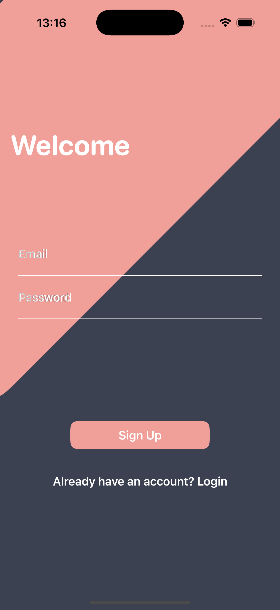

# CatTinder - Small iOS school project

CatTinder is a playful mobile application that allows users to browse cat images, like their favorites, and manage a list of liked cats. The app mimics a Tinder-style swipe mechanism for an engaging user experience.

## Features

- **Swipe to Like**: Users can swipe right to like and left to dislike cat images.
- **Saved Favorites**: Liked cats are stored in a separate list for later viewing.
- **Smooth Image Loading**: Uses caching for efficient image display.
- **Firebase Integration**: Backend support for authentication and data storage.
- **Public Cat API**: Cat images are loaded dynamically from a public cat API.

## Technologies Used

- **SwiftUI**: Modern UI framework for building the application.
- **Firebase**: Backend support for authentication and data management.
- **AsyncImage & Caching**: Ensures smooth image loading and performance optimization.
- **MVVM Architecture**: Separates business logic from the UI for better maintainability.

